# Chương 2 - Use Case và Biểu đồ tuần tự cho RoommieMatch

Tài liệu chương 2 này trình bày các sơ đồ Use Case, sơ đồ tuần tự (Sequence Diagram) và biểu đồ quy trình (Flowchart) cho hệ thống RoommieMatch.

> Dùng Markdown Preview trong VS Code để xem biểu đồ Mermaid, hoặc extension hỗ trợ Mermaid để xuất ảnh.

---

## 2.1 Use Case tổng quát

<svg width="860" height="820" viewBox="0 0 860 820" xmlns="http://www.w3.org/2000/svg">
  

  <text x="430" y="24" class="title" text-anchor="middle">General Use Case Diagram - RoommieMatch System</text>

  <!-- Actors -->
  <g transform="translate(105 150)">
    <circle cx="0" cy="0" r="8" class="actorHead"/>
    <line x1="0" y1="8" x2="0" y2="36" class="actor"/>
    <line x1="-16" y1="20" x2="16" y2="20" class="actor"/>
    <line x1="0" y1="36" x2="-14" y2="58" class="actor"/>
    <line x1="0" y1="36" x2="14" y2="58" class="actor"/>
    <text x="0" y="80" class="actorText">Người dùng</text>
  </g>

  <g transform="translate(105 330)">
    <circle cx="0" cy="0" r="8" class="actorHead"/>
    <line x1="0" y1="8" x2="0" y2="36" class="actor"/>
    <line x1="-16" y1="20" x2="16" y2="20" class="actor"/>
    <line x1="0" y1="36" x2="-14" y2="58" class="actor"/>
    <line x1="0" y1="36" x2="14" y2="58" class="actor"/>
    <text x="0" y="80" class="actorText">Tenant</text>
    <text x="0" y="96" class="actorText">Người thuê</text>
  </g>

  <g transform="translate(105 510)">
    <circle cx="0" cy="0" r="8" class="actorHead"/>
    <line x1="0" y1="8" x2="0" y2="36" class="actor"/>
    <line x1="-16" y1="20" x2="16" y2="20" class="actor"/>
    <line x1="0" y1="36" x2="-14" y2="58" class="actor"/>
    <line x1="0" y1="36" x2="14" y2="58" class="actor"/>
    <text x="0" y="80" class="actorText">Landlord</text>
    <text x="0" y="96" class="actorText">Chủ trọ</text>
  </g>

  <g transform="translate(105 690)">
    <circle cx="0" cy="0" r="8" class="actorHead"/>
    <line x1="0" y1="8" x2="0" y2="36" class="actor"/>
    <line x1="-16" y1="20" x2="16" y2="20" class="actor"/>
    <line x1="0" y1="36" x2="-14" y2="58" class="actor"/>
    <line x1="0" y1="36" x2="14" y2="58" class="actor"/>
    <text x="0" y="80" class="actorText">Admin</text>
    <text x="0" y="96" class="actorText">Quản trị viên</text>
  </g>

  <!-- System boundary -->
  <rect x="230" y="48" width="560" height="735" rx="0" class="system"/>
  <text x="510" y="72" class="label" text-anchor="middle">Hệ thống RoommieMatch</text>

  <!-- Common module -->
  <rect x="260" y="90" width="500" height="130" rx="0" class="module"/>
  <text x="276" y="112" class="label">Xác thực &amp; Tài khoản</text>
  <ellipse id="auth" cx="385" cy="145" rx="105" ry="23" class="usecase"/>
  <text x="385" y="141" class="small" text-anchor="middle">Đăng nhập / Đăng ký</text>
  <text x="385" y="156" class="small" text-anchor="middle">Quên mật khẩu</text>
  <ellipse id="profile" cx="625" cy="145" rx="100" ry="23" class="usecase"/>
  <text x="625" y="149" class="small" text-anchor="middle">Quản lý hồ sơ cá nhân</text>
  <ellipse id="chat" cx="505" cy="190" rx="88" ry="22" class="usecase"/>
  <text x="505" y="194" class="small" text-anchor="middle">Chat &amp; Thông báo</text>

  <!-- Tenant module -->
  <rect x="260" y="245" width="500" height="165" rx="0" class="module"/>
  <text x="276" y="267" class="label">Phân hệ Tenant</text>
  <ellipse id="search" cx="385" cy="300" rx="95" ry="22" class="usecase"/>
  <text x="385" y="304" class="small" text-anchor="middle">Tìm kiếm &amp; xem phòng</text>
  <ellipse id="favorite" cx="625" cy="300" rx="90" ry="22" class="usecase"/>
  <text x="625" y="304" class="small" text-anchor="middle">Lưu phòng yêu thích</text>
  <ellipse id="request" cx="385" cy="360" rx="115" ry="23" class="usecase"/>
  <text x="385" y="356" class="small" text-anchor="middle">Gửi &amp; quản lý yêu cầu</text>
  <text x="385" y="371" class="small" text-anchor="middle">ở ghép</text>
  <ellipse id="appointment" cx="625" cy="360" rx="105" ry="23" class="usecase"/>
  <text x="625" y="356" class="small" text-anchor="middle">Đặt &amp; quản lý</text>
  <text x="625" y="371" class="small" text-anchor="middle">lịch hẹn</text>

  <!-- Landlord module -->
  <rect x="260" y="435" width="500" height="135" rx="0" class="module"/>
  <text x="276" y="457" class="label">Phân hệ Landlord</text>
  <ellipse id="listings" cx="385" cy="495" rx="100" ry="22" class="usecase"/>
  <text x="385" y="499" class="small" text-anchor="middle">Quản lý tin đăng phòng</text>
  <ellipse id="handleRequest" cx="625" cy="495" rx="100" ry="22" class="usecase"/>
  <text x="625" y="499" class="small" text-anchor="middle">Xử lý yêu cầu ở ghép</text>
  <ellipse id="manageAppointment" cx="505" cy="545" rx="105" ry="22" class="usecase"/>
  <text x="505" y="549" class="small" text-anchor="middle">Xác nhận / hủy lịch hẹn</text>

  <!-- Admin module -->
  <rect x="260" y="595" width="500" height="160" rx="0" class="module"/>
  <text x="276" y="617" class="label">Phân hệ Quản trị</text>
  <ellipse id="manageUsers" cx="385" cy="650" rx="112" ry="23" class="usecase"/>
  <text x="385" y="646" class="small" text-anchor="middle">Quản lý người dùng</text>
  <text x="385" y="661" class="small" text-anchor="middle">&amp; phân quyền</text>
  <ellipse id="review" cx="625" cy="650" rx="103" ry="22" class="usecase"/>
  <text x="625" y="654" class="small" text-anchor="middle">Kiểm duyệt tin đăng</text>
  <ellipse id="report" cx="385" cy="710" rx="103" ry="22" class="usecase"/>
  <text x="385" y="714" class="small" text-anchor="middle">Xử lý báo cáo vi phạm</text>
  <ellipse id="dashboard" cx="625" cy="710" rx="95" ry="22" class="usecase"/>
  <text x="625" y="714" class="small" text-anchor="middle">Xem dashboard</text>

  <!-- Associations -->
  <path class="link" d="M122 170 C180 130, 245 135, 280 145"/>
  <path class="link" d="M122 175 C190 155, 245 150, 525 145"/>
  <path class="link" d="M122 185 C190 205, 260 205, 417 190"/>

  <path class="link" d="M122 350 C175 305, 230 300, 290 300"/>
  <path class="link" d="M122 355 C190 310, 510 300, 535 300"/>
  <path class="link" d="M122 365 C180 365, 235 360, 270 360"/>
  <path class="link" d="M122 375 C200 390, 510 365, 520 360"/>
  <path class="link" d="M122 385 C205 430, 440 205, 435 190"/>
  <path class="link" d="M122 390 C200 420, 520 155, 530 145"/>

  <path class="link" d="M122 530 C180 500, 240 495, 285 495"/>
  <path class="link" d="M122 540 C210 520, 500 495, 525 495"/>
  <path class="link" d="M122 550 C210 590, 405 545, 400 545"/>
  <path class="link" d="M122 560 C195 565, 425 205, 435 190"/>
  <path class="link" d="M122 565 C190 590, 520 160, 530 145"/>

  <path class="link" d="M122 710 C185 675, 245 650, 273 650"/>
  <path class="link" d="M122 715 C210 685, 520 650, 522 650"/>
  <path class="link" d="M122 725 C190 735, 265 710, 282 710"/>
  <path class="link" d="M122 735 C210 755, 530 710, 530 710"/>
</svg>

### 2.1.1 Nhóm chức năng A: Xác thực & Tài khoản

#### Use Case Đăng nhập, Đăng ký & Quên mật khẩu

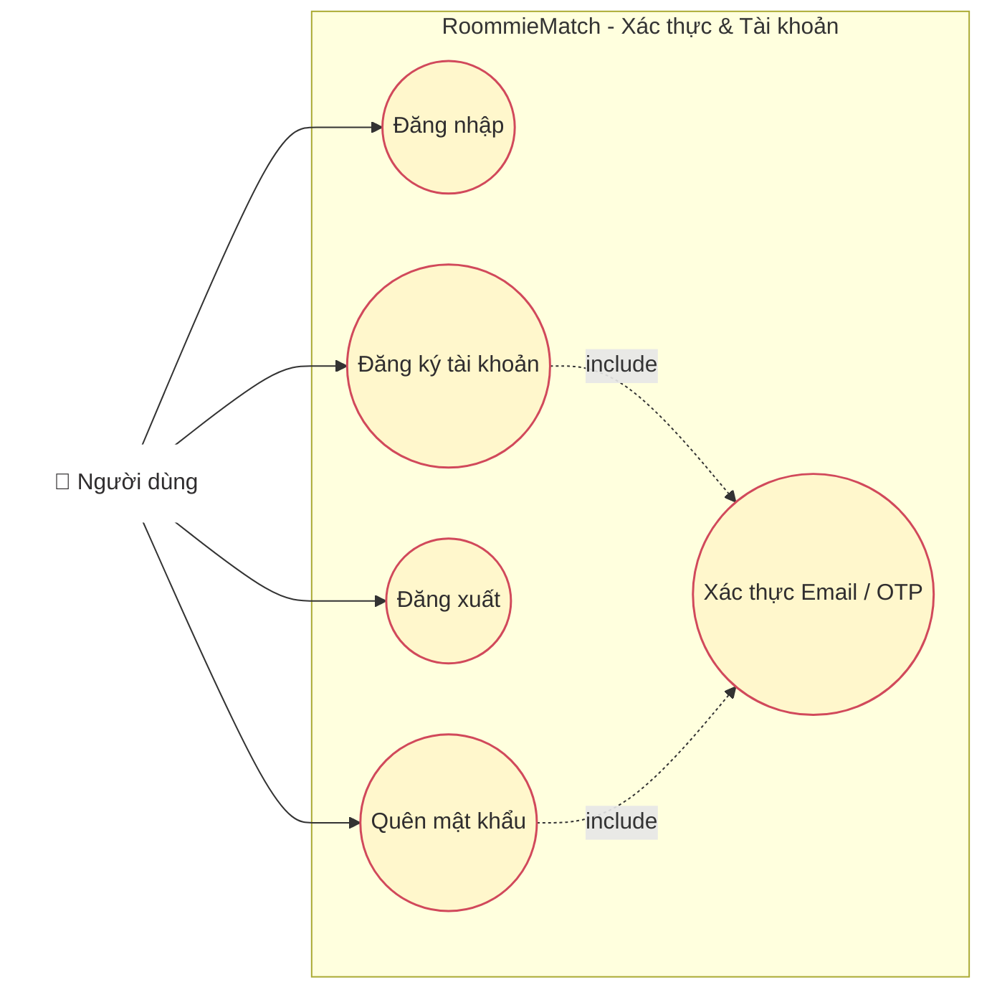
```mermaid
graph LR
  classDef actor fill:#ffffff,stroke:#ffffff,color:#2f2d2e;
  classDef usecase fill:#fff7cc,stroke:#d1495b,stroke-width:1.5px,color:#2f2d2e;

  UserActor["👤 Người dùng"]:::actor

  subgraph System[RoommieMatch - Xác thực & Tài khoản]
    direction LR
    Login(("Đăng nhập")):::usecase
    Register(("Đăng ký tài khoản")):::usecase
    Logout(("Đăng xuất")):::usecase
    Forgot(("Quên mật khẩu")):::usecase
    Verify(("Xác thực Email / OTP")):::usecase
  end

  UserActor --> Login
  UserActor --> Register
  UserActor --> Logout
  UserActor --> Forgot
  Register -.->|include| Verify
  Forgot -.->|include| Verify
```

#### Use Case Quản lý hồ sơ cá nhân

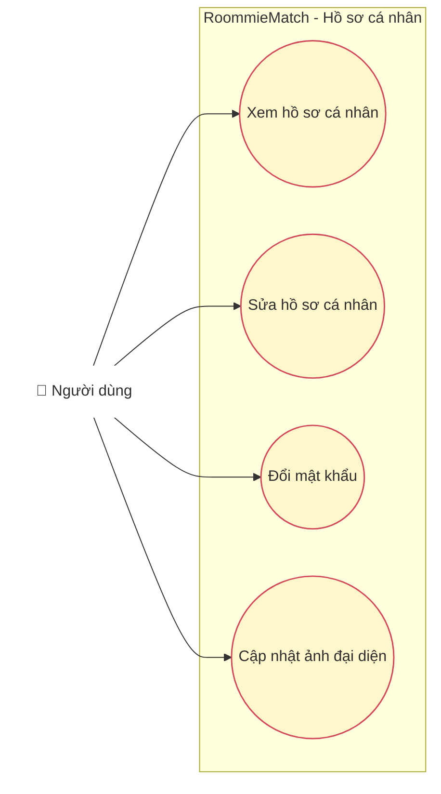
```mermaid
graph LR
  classDef actor fill:#ffffff,stroke:#ffffff,color:#2f2d2e;
  classDef usecase fill:#fff7cc,stroke:#d1495b,stroke-width:1.5px,color:#2f2d2e;

  UserActor["👤 Người dùng"]:::actor

  subgraph System[RoommieMatch - Hồ sơ cá nhân]
    direction LR
    ViewProfile(("Xem hồ sơ cá nhân")):::usecase
    EditProfile(("Sửa hồ sơ cá nhân")):::usecase
    ChangePassword(("Đổi mật khẩu")):::usecase
    UpdatePhoto(("Cập nhật ảnh đại diện")):::usecase
  end

  UserActor --> ViewProfile
  UserActor --> EditProfile
  UserActor --> ChangePassword
  UserActor --> UpdatePhoto
```

### 2.1.2 Nhóm chức năng B: Tenant (Người thuê)

#### Use Case Tìm kiếm & Xem phòng

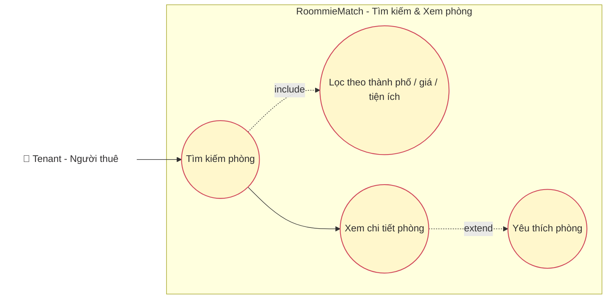
```mermaid
graph LR
  classDef actor fill:#ffffff,stroke:#ffffff,color:#2f2d2e;
  classDef usecase fill:#fff7cc,stroke:#d1495b,stroke-width:1.5px,color:#2f2d2e;

  TenantActor["👤 Tenant - Người thuê"]:::actor

  subgraph System[RoommieMatch - Tìm kiếm & Xem phòng]
    direction LR
    Search(("Tìm kiếm phòng")):::usecase
    Filter(("Lọc theo thành phố / giá / tiện ích")):::usecase
    ViewRoom(("Xem chi tiết phòng")):::usecase
    Favorite(("Yêu thích phòng")):::usecase
  end

  TenantActor --> Search
  Search -.->|include| Filter
  Search --> ViewRoom
  ViewRoom -.->|extend| Favorite
```

#### Use Case Gửi & Quản lý yêu cầu ở ghép (Roommate Requests)

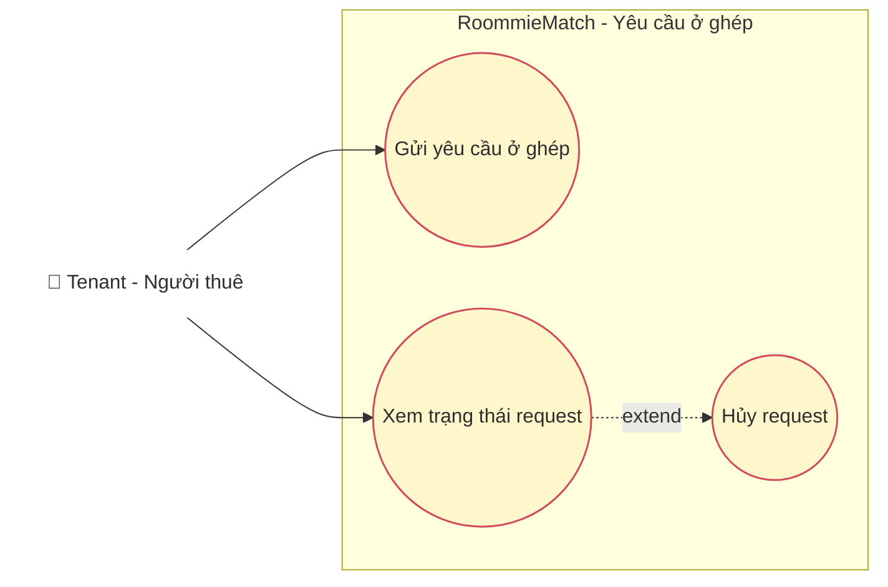
```mermaid
graph LR
  classDef actor fill:#ffffff,stroke:#ffffff,color:#2f2d2e;
  classDef usecase fill:#fff7cc,stroke:#d1495b,stroke-width:1.5px,color:#2f2d2e;

  TenantActor["👤 Tenant - Người thuê"]:::actor

  subgraph System[RoommieMatch - Yêu cầu ở ghép]
    direction LR
    SendRequest(("Gửi yêu cầu ở ghép")):::usecase
    ViewRequests(("Xem trạng thái request")):::usecase
    CancelRequest(("Hủy request")):::usecase
  end

  TenantActor --> SendRequest
  TenantActor --> ViewRequests
  ViewRequests -.->|extend| CancelRequest
```

#### Use Case Đặt & Quản lý lịch hẹn xem phòng (Appointments)

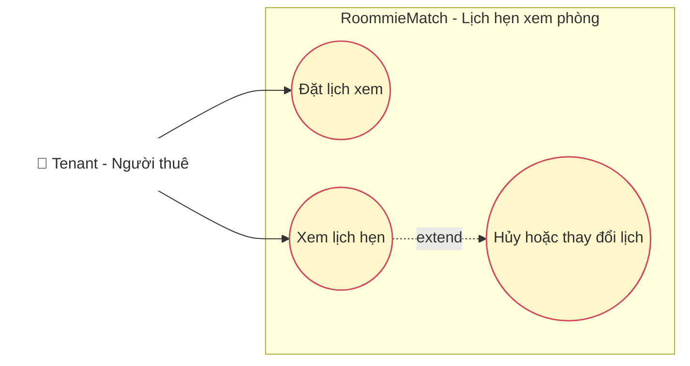
```mermaid
graph LR
  classDef actor fill:#ffffff,stroke:#ffffff,color:#2f2d2e;
  classDef usecase fill:#fff7cc,stroke:#d1495b,stroke-width:1.5px,color:#2f2d2e;

  TenantActor["👤 Tenant - Người thuê"]:::actor

  subgraph System[RoommieMatch - Lịch hẹn xem phòng]
    direction LR
    BookAppointment(("Đặt lịch xem")):::usecase
    ViewAppointments(("Xem lịch hẹn")):::usecase
    CancelAppointment(("Hủy hoặc thay đổi lịch")):::usecase
  end

  TenantActor --> BookAppointment
  TenantActor --> ViewAppointments
  ViewAppointments -.->|extend| CancelAppointment
```

#### Use Case Chat & Thông báo

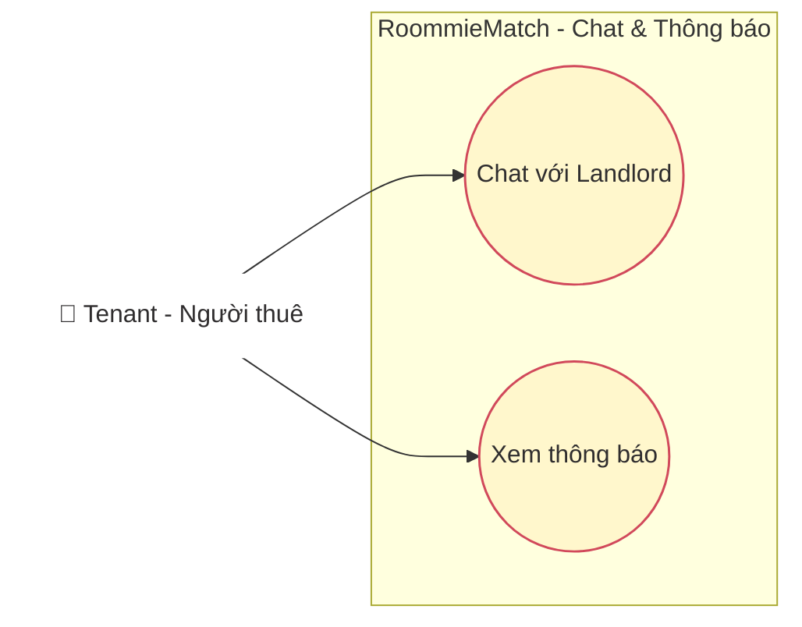
```mermaid
graph LR
  classDef actor fill:#ffffff,stroke:#ffffff,color:#2f2d2e;
  classDef usecase fill:#fff7cc,stroke:#d1495b,stroke-width:1.5px,color:#2f2d2e;

  TenantActor["👤 Tenant - Người thuê"]:::actor

  subgraph System[RoommieMatch - Chat & Thông báo]
    direction LR
    Chat(("Chat với Landlord")):::usecase
    Notifications(("Xem thông báo")):::usecase
  end

  TenantActor --> Chat
  TenantActor --> Notifications
```

#### Use Case Quản lý tin đăng phòng

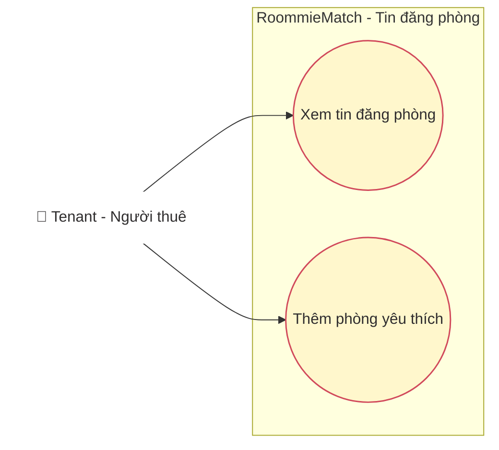
```mermaid
graph LR
  classDef actor fill:#ffffff,stroke:#ffffff,color:#2f2d2e;
  classDef usecase fill:#fff7cc,stroke:#d1495b,stroke-width:1.5px,color:#2f2d2e;

  TenantActor["👤 Tenant - Người thuê"]:::actor

  subgraph System[RoommieMatch - Tin đăng phòng]
    direction LR
    ViewListings(("Xem tin đăng phòng")):::usecase
    Favorite(("Thêm phòng yêu thích")):::usecase
  end

  TenantActor --> ViewListings
  TenantActor --> Favorite
```

#### Use Case Xử lý yêu cầu ở ghép

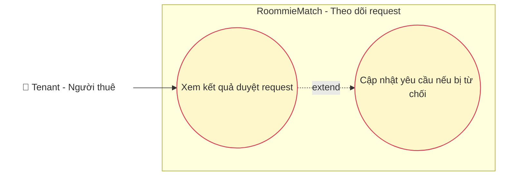
```mermaid
graph LR
  classDef actor fill:#ffffff,stroke:#ffffff,color:#2f2d2e;
  classDef usecase fill:#fff7cc,stroke:#d1495b,stroke-width:1.5px,color:#2f2d2e;

  TenantActor["👤 Tenant - Người thuê"]:::actor

  subgraph System[RoommieMatch - Theo dõi request]
    direction LR
    ReviewResponse(("Xem kết quả duyệt request")):::usecase
    UpdateRequest(("Cập nhật yêu cầu nếu bị từ chối")):::usecase
  end

  TenantActor --> ReviewResponse
  ReviewResponse -.->|extend| UpdateRequest
```

#### Use Case Quản lý lịch hẹn xem phòng

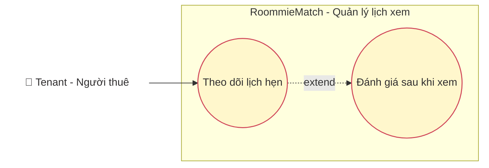
```mermaid
graph LR
  classDef actor fill:#ffffff,stroke:#ffffff,color:#2f2d2e;
  classDef usecase fill:#fff7cc,stroke:#d1495b,stroke-width:1.5px,color:#2f2d2e;

  TenantActor["👤 Tenant - Người thuê"]:::actor

  subgraph System[RoommieMatch - Quản lý lịch xem]
    direction LR
    TrackAppointments(("Theo dõi lịch hẹn")):::usecase
    RateVisit(("Đánh giá sau khi xem")):::usecase
  end

  TenantActor --> TrackAppointments
  TrackAppointments -.->|extend| RateVisit
```

### 2.1.3 Nhóm chức năng C: Landlord (Chủ trọ)

#### Use Case Quản lý tin đăng phòng

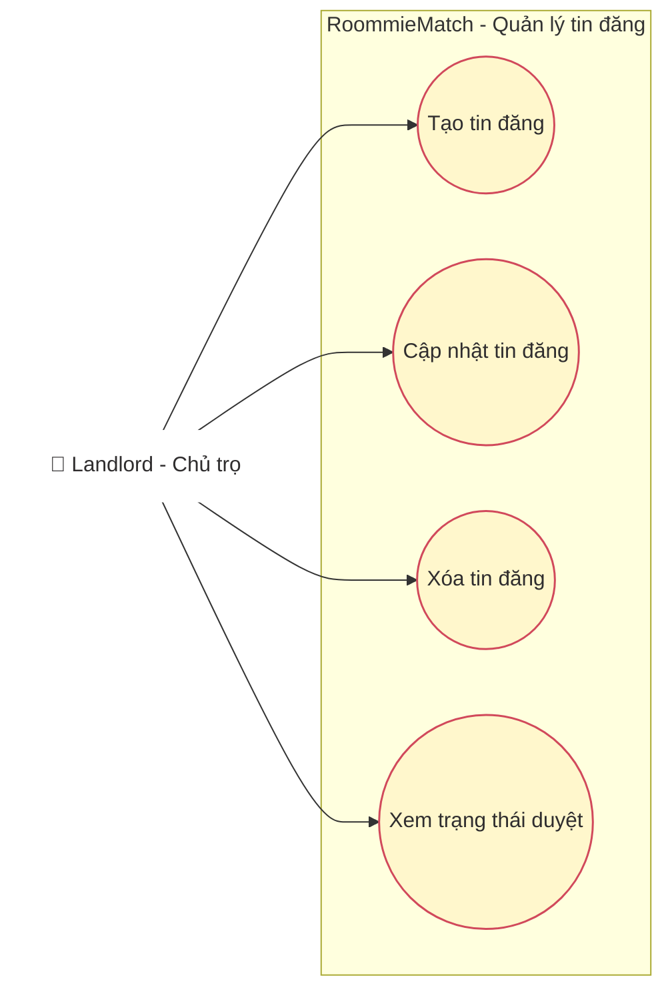
```mermaid
graph LR
  classDef actor fill:#ffffff,stroke:#ffffff,color:#2f2d2e;
  classDef usecase fill:#fff7cc,stroke:#d1495b,stroke-width:1.5px,color:#2f2d2e;

  LandlordActor["👤 Landlord - Chủ trọ"]:::actor

  subgraph System[RoommieMatch - Quản lý tin đăng]
    direction LR
    CreateListing(("Tạo tin đăng")):::usecase
    UpdateListing(("Cập nhật tin đăng")):::usecase
    DeleteListing(("Xóa tin đăng")):::usecase
    ViewListingStatus(("Xem trạng thái duyệt")):::usecase
  end

  LandlordActor --> CreateListing
  LandlordActor --> UpdateListing
  LandlordActor --> DeleteListing
  LandlordActor --> ViewListingStatus
```

#### Use Case Xử lý yêu cầu ở ghép

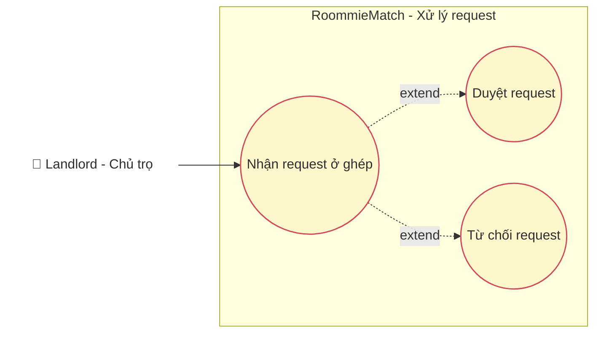
```mermaid
graph LR
  classDef actor fill:#ffffff,stroke:#ffffff,color:#2f2d2e;
  classDef usecase fill:#fff7cc,stroke:#d1495b,stroke-width:1.5px,color:#2f2d2e;

  LandlordActor["👤 Landlord - Chủ trọ"]:::actor

  subgraph System[RoommieMatch - Xử lý request]
    direction LR
    ReceiveRequest(("Nhận request ở ghép")):::usecase
    ApproveRequest(("Duyệt request")):::usecase
    RejectRequest(("Từ chối request")):::usecase
  end

  LandlordActor --> ReceiveRequest
  ReceiveRequest -.->|extend| ApproveRequest
  ReceiveRequest -.->|extend| RejectRequest
```

#### Use Case Quản lý lịch hẹn xem phòng

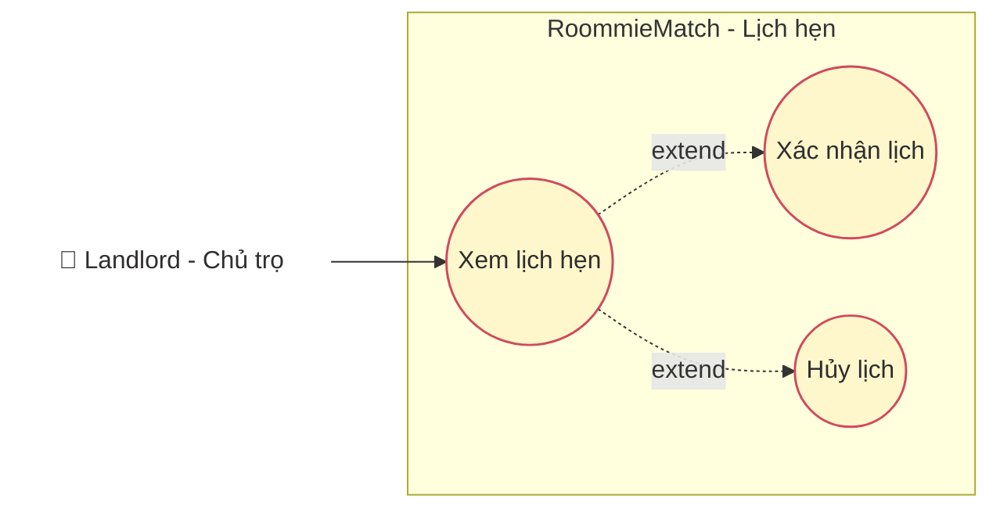
```mermaid
graph LR
  classDef actor fill:#ffffff,stroke:#ffffff,color:#2f2d2e;
  classDef usecase fill:#fff7cc,stroke:#d1495b,stroke-width:1.5px,color:#2f2d2e;

  LandlordActor["👤 Landlord - Chủ trọ"]:::actor

  subgraph System[RoommieMatch - Lịch hẹn]
    direction LR
    ViewAppointments(("Xem lịch hẹn")):::usecase
    ConfirmAppointment(("Xác nhận lịch")):::usecase
    CancelAppointment(("Hủy lịch")):::usecase
  end

  LandlordActor --> ViewAppointments
  ViewAppointments -.->|extend| ConfirmAppointment
  ViewAppointments -.->|extend| CancelAppointment
```

#### Use Case Chat & Thông báo

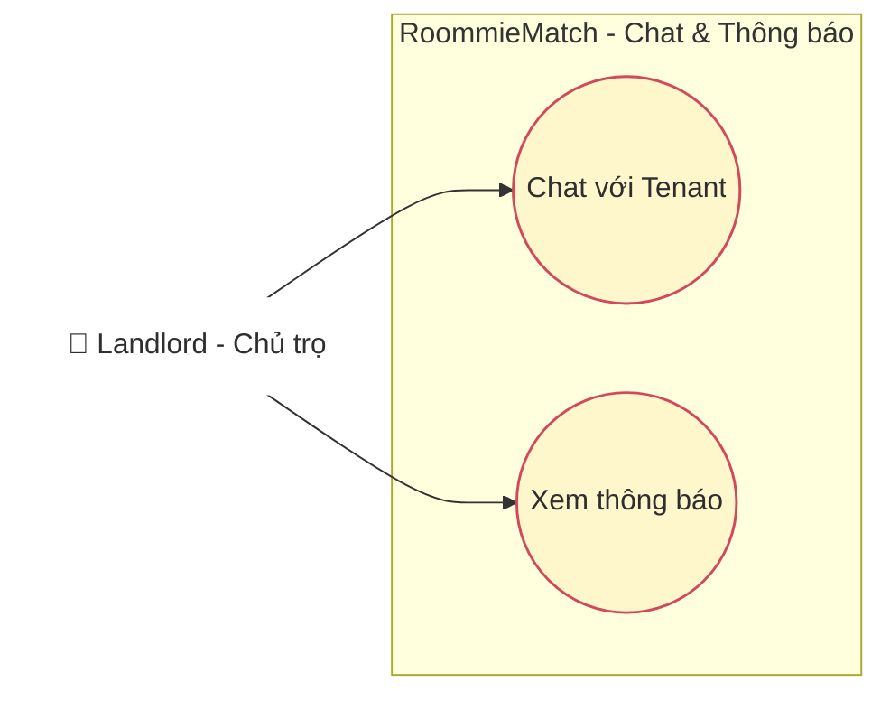
```mermaid
graph LR
  classDef actor fill:#ffffff,stroke:#ffffff,color:#2f2d2e;
  classDef usecase fill:#fff7cc,stroke:#d1495b,stroke-width:1.5px,color:#2f2d2e;

  LandlordActor["👤 Landlord - Chủ trọ"]:::actor

  subgraph System[RoommieMatch - Chat & Thông báo]
    direction LR
    Chat(("Chat với Tenant")):::usecase
    Notifications(("Xem thông báo")):::usecase
  end

  LandlordActor --> Chat
  LandlordActor --> Notifications
```

### 2.1.4 Nhóm chức năng D: Quản trị (Admin)

#### Use Case Quản lý Nhân sự & Phân quyền

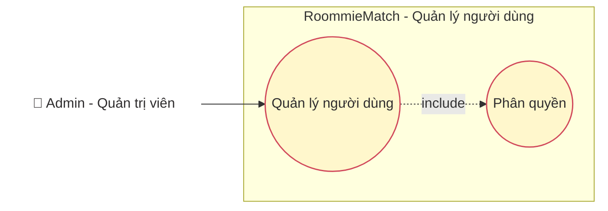
```mermaid
graph LR
  classDef actor fill:#ffffff,stroke:#ffffff,color:#2f2d2e;
  classDef usecase fill:#fff7cc,stroke:#d1495b,stroke-width:1.5px,color:#2f2d2e;

  AdminActor["👤 Admin - Quản trị viên"]:::actor

  subgraph System[RoommieMatch - Quản lý người dùng]
    direction LR
    ManageUsers(("Quản lý người dùng")):::usecase
    AssignRoles(("Phân quyền")):::usecase
  end

  AdminActor --> ManageUsers
  ManageUsers -.->|include| AssignRoles
```

#### Use Case Kiểm duyệt bài đăng phòng

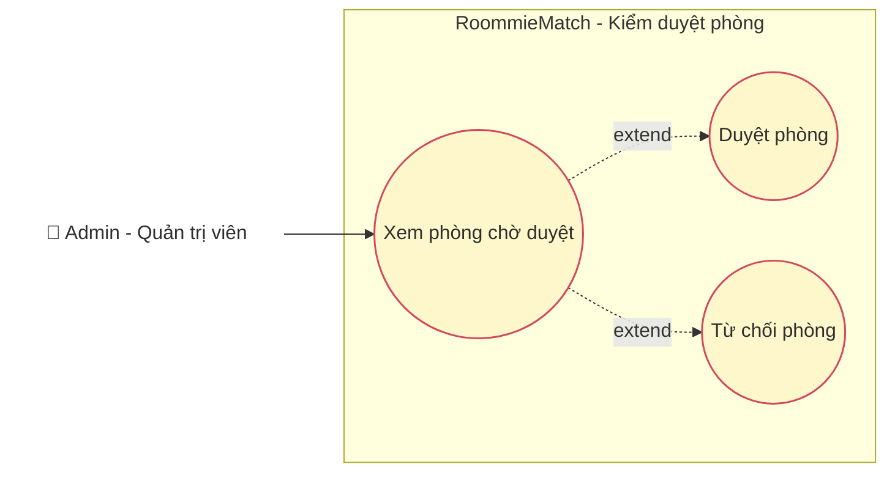
```mermaid
graph LR
  classDef actor fill:#ffffff,stroke:#ffffff,color:#2f2d2e;
  classDef usecase fill:#fff7cc,stroke:#d1495b,stroke-width:1.5px,color:#2f2d2e;

  AdminActor["👤 Admin - Quản trị viên"]:::actor

  subgraph System[RoommieMatch - Kiểm duyệt phòng]
    direction LR
    ReviewListings(("Xem phòng chờ duyệt")):::usecase
    ApproveListing(("Duyệt phòng")):::usecase
    RejectListing(("Từ chối phòng")):::usecase
  end

  AdminActor --> ReviewListings
  ReviewListings -.->|extend| ApproveListing
  ReviewListings -.->|extend| RejectListing
```

#### Use Case Xử lý báo cáo vi phạm

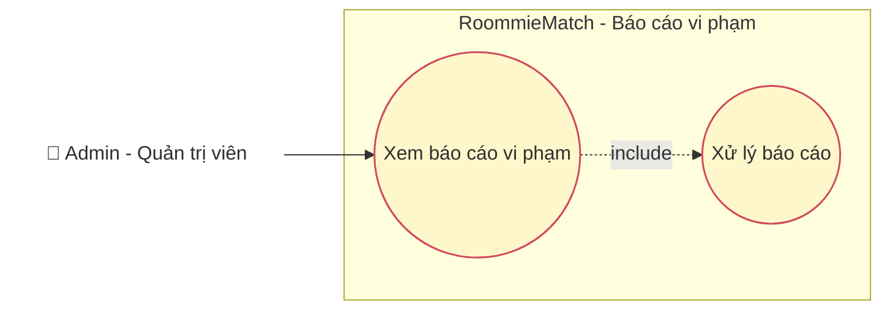
```mermaid
graph LR
  classDef actor fill:#ffffff,stroke:#ffffff,color:#2f2d2e;
  classDef usecase fill:#fff7cc,stroke:#d1495b,stroke-width:1.5px,color:#2f2d2e;

  AdminActor["👤 Admin - Quản trị viên"]:::actor

  subgraph System[RoommieMatch - Báo cáo vi phạm]
    direction LR
    ViewReports(("Xem báo cáo vi phạm")):::usecase
    HandleReports(("Xử lý báo cáo")):::usecase
  end

  AdminActor --> ViewReports
  ViewReports -.->|include| HandleReports
```

#### Use Case Dashboard tổng quan hệ thống

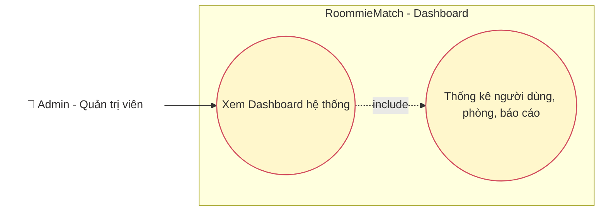
```mermaid
graph LR
  classDef actor fill:#ffffff,stroke:#ffffff,color:#2f2d2e;
  classDef usecase fill:#fff7cc,stroke:#d1495b,stroke-width:1.5px,color:#2f2d2e;

  AdminActor["👤 Admin - Quản trị viên"]:::actor

  subgraph System[RoommieMatch - Dashboard]
    direction LR
    Dashboard(("Xem Dashboard hệ thống")):::usecase
    SystemMetrics(("Thống kê người dùng, phòng, báo cáo")):::usecase
  end

  AdminActor --> Dashboard
  Dashboard -.->|include| SystemMetrics
```

---
## 2.2 Sơ đồ tuần tự (Sequence Diagrams)

### 2.2.1 Quy trình Tenant tìm phòng và gửi yêu cầu ở ghép

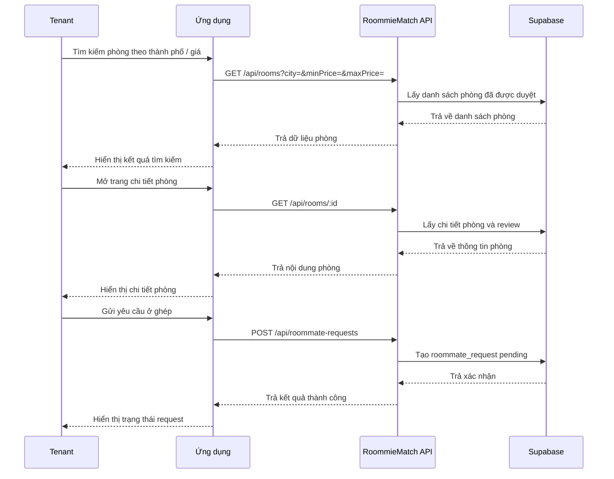
```mermaid
sequenceDiagram
  participant Tenant as Tenant
  participant Frontend as Ứng dụng
  participant Backend as RoommieMatch API
  participant DB as Supabase

  Tenant->>Frontend: Tìm kiếm phòng theo thành phố / giá
  Frontend->>Backend: GET /api/rooms?city=&minPrice=&maxPrice=
  Backend->>DB: Lấy danh sách phòng đã được duyệt
  DB-->>Backend: Trả về danh sách phòng
  Backend-->>Frontend: Trả dữ liệu phòng
  Frontend-->>Tenant: Hiển thị kết quả tìm kiếm
  Tenant->>Frontend: Mở trang chi tiết phòng
  Frontend->>Backend: GET /api/rooms/:id
  Backend->>DB: Lấy chi tiết phòng và review
  DB-->>Backend: Trả về thông tin phòng
  Backend-->>Frontend: Trả nội dung phòng
  Frontend-->>Tenant: Hiển thị chi tiết phòng
  Tenant->>Frontend: Gửi yêu cầu ở ghép
  Frontend->>Backend: POST /api/roommate-requests
  Backend->>DB: Tạo roommate_request pending
  DB-->>Backend: Trả xác nhận
  Backend-->>Frontend: Trả kết quả thành công
  Frontend-->>Tenant: Hiển thị trạng thái request
```

### 2.2.2 Quy trình Landlord đăng tin và Admin duyệt phòng

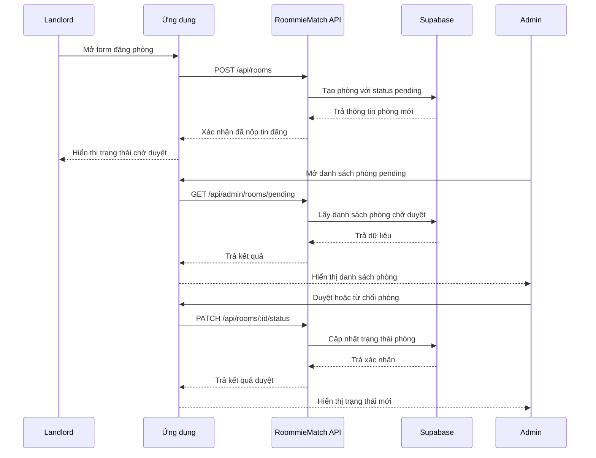
```mermaid
sequenceDiagram
  participant Landlord as Landlord
  participant Frontend as Ứng dụng
  participant Backend as RoommieMatch API
  participant DB as Supabase
  participant Admin as Admin

  Landlord->>Frontend: Mở form đăng phòng
  Frontend->>Backend: POST /api/rooms
  Backend->>DB: Tạo phòng với status pending
  DB-->>Backend: Trả thông tin phòng mới
  Backend-->>Frontend: Xác nhận đã nộp tin đăng
  Frontend-->>Landlord: Hiển thị trạng thái chờ duyệt

  Admin->>Frontend: Mở danh sách phòng pending
  Frontend->>Backend: GET /api/admin/rooms/pending
  Backend->>DB: Lấy danh sách phòng chờ duyệt
  DB-->>Backend: Trả dữ liệu
  Backend-->>Frontend: Trả kết quả
  Frontend-->>Admin: Hiển thị danh sách phòng
  Admin->>Frontend: Duyệt hoặc từ chối phòng
  Frontend->>Backend: PATCH /api/rooms/:id/status
  Backend->>DB: Cập nhật trạng thái phòng
  DB-->>Backend: Trả xác nhận
  Backend-->>Frontend: Trả kết quả duyệt
  Frontend-->>Admin: Hiển thị trạng thái mới
```

### 2.2.3 Quy trình Tenant đặt lịch xem nhà và Landlord xác nhận

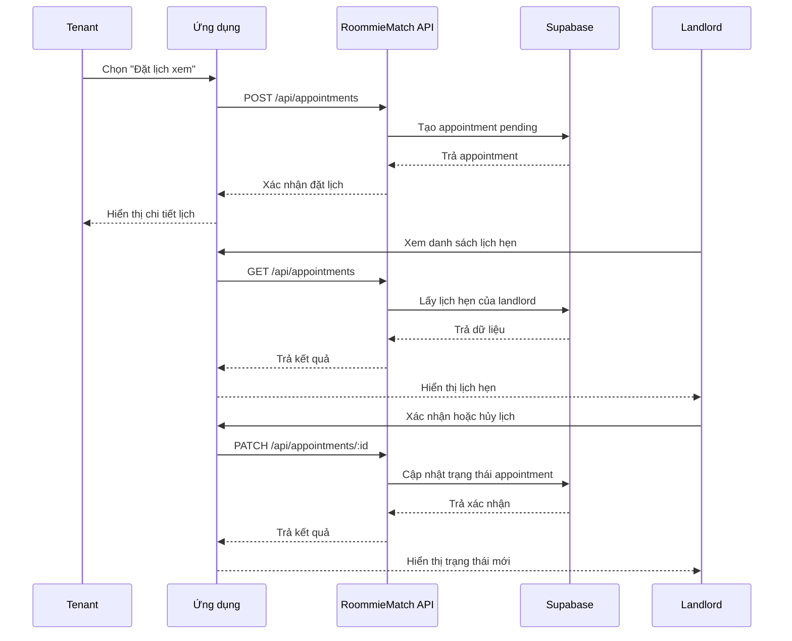
```mermaid
sequenceDiagram
  participant Tenant as Tenant
  participant Frontend as Ứng dụng
  participant Backend as RoommieMatch API
  participant DB as Supabase
  participant Landlord as Landlord

  Tenant->>Frontend: Chọn "Đặt lịch xem"
  Frontend->>Backend: POST /api/appointments
  Backend->>DB: Tạo appointment pending
  DB-->>Backend: Trả appointment
  Backend-->>Frontend: Xác nhận đặt lịch
  Frontend-->>Tenant: Hiển thị chi tiết lịch

  Landlord->>Frontend: Xem danh sách lịch hẹn
  Frontend->>Backend: GET /api/appointments
  Backend->>DB: Lấy lịch hẹn của landlord
  DB-->>Backend: Trả dữ liệu
  Backend-->>Frontend: Trả kết quả
  Frontend-->>Landlord: Hiển thị lịch hẹn
  Landlord->>Frontend: Xác nhận hoặc hủy lịch
  Frontend->>Backend: PATCH /api/appointments/:id
  Backend->>DB: Cập nhật trạng thái appointment
  DB-->>Backend: Trả xác nhận
  Backend-->>Frontend: Trả kết quả
  Frontend-->>Landlord: Hiển thị trạng thái mới
```

---

## 2.3 Biểu đồ hoạt động

Phần này trình bày các biểu đồ hoạt động (activity diagrams) cho các luồng nghiệp vụ chính của hệ thống RoommieMatch.

### 2.3.1 Quy trình tìm phòng và xem chi tiết phòng

```mermaid
flowchart TD
  A[Tenant mở ứng dụng] --> B[Tìm kiếm phòng theo thành phố, giá, tiện ích]
  B --> C{Có kết quả phù hợp không?}
  C -->|Có| D[Xem danh sách phòng đã được duyệt]
  C -->|Không| E[Hiển thị thông báo không tìm thấy]
  D --> F[Chọn phòng để xem chi tiết]
  F --> G{Xem chi tiết phòng}
  G --> H[Xem ảnh, mô tả, giá, tiện ích, review]
  H --> I{Tiếp tục tìm phòng hay gửi yêu cầu?}
  I -->|Tiếp tục tìm| B
  I -->|Gửi yêu cầu| J[Đi đến form yêu cầu ở ghép hoặc đặt lịch xem]
```

### 2.3.2 Quy trình đăng tin phòng của Landlord

```mermaid
flowchart TD
  A[Landlord mở form đăng tin phòng] --> B[Nhập thông tin phòng, địa chỉ, giá, ảnh]
  B --> C{Thông tin hợp lệ không?}
  C -->|Không| D[Hiển thị lỗi và yêu cầu chỉnh sửa]
  C -->|Có| E[Gửi thông tin phòng lên server]
  E --> F[Server tạo phòng với trạng thái pending]
  F --> G[Hiển thị trạng thái chờ duyệt cho Landlord]
```

### 2.3.3 Quy trình gửi và xử lý yêu cầu ở ghép

```mermaid
flowchart TD
  A[Tenant mở chi tiết phòng] --> B[Nhấn gửi yêu cầu ở ghép]
  B --> C[Nhập nội dung yêu cầu và gửi]
  C --> D[Server tạo roommate_request trạng thái pending]
  D --> E[Landlord nhận thông báo request]
  E --> F{Landlord duyệt hay từ chối?}
  F -->|Duyệt| G[Cập nhật trạng thái accepted và thông báo Tenant]
  F -->|Từ chối| H[Cập nhật trạng thái rejected và thông báo Tenant]
  G --> I[Tenant xem kết quả duyệt]
  H --> I
```

### 2.3.4 Quy trình đặt lịch hẹn xem phòng

```mermaid
flowchart TD
  A[Tenant mở chi tiết phòng] --> B[Nhấn Đặt lịch xem]
  B --> C[Chọn ngày giờ và nhập yêu cầu]
  C --> D[Gửi yêu cầu đặt lịch lên server]
  D --> E[Server tạo appointment trạng thái pending]
  E --> F[Landlord nhận thông báo lịch hẹn]
  F --> G{Landlord xác nhận hay hủy?}
  G -->|Xác nhận| H[Cập nhật appointment = confirmed và thông báo Tenant]
  G -->|Hủy| I[Cập nhật appointment = cancelled và thông báo Tenant]
```

### 2.3.5 Quy trình kiểm duyệt bài đăng phòng của Admin

```mermaid
flowchart TD
  A[Admin mở danh sách phòng pending] --> B[Xem chi tiết phòng chờ duyệt]
  B --> C{Phòng hợp lệ không?}
  C -->|Có| D[Chọn duyệt phòng]
  C -->|Không| E[Chọn từ chối phòng]
  D --> F[Cập nhật trạng thái room = approved]
  E --> G[Cập nhật trạng thái room = rejected]
  F --> H[Phòng xuất hiện trên marketplace]
  G --> I[Thông báo từ chối gửi về Landlord]
```

### 2.3.6 Quy trình Chatbot

```mermaid
flowchart TD
  A[User mở Chatbot hoặc Chat page] --> B[Nhập câu hỏi hoặc tin nhắn]
  B --> C[Gửi tin nhắn tới backend AI/Chatbot]
  C --> D[Backend xử lý và gọi API AI nếu cần]
  D --> E[Trả về câu trả lời / gợi ý]
  E --> F[Hiển thị phản hồi cho User]
  F --> G{User cần hỏi tiếp không?}
  G -->|Có| B
  G -->|Không| H[Kết thúc phiên chat]
```

---

## 2.4 Biểu đồ trình tự

### 2.4.1 Quy trình Tenant tìm phòng và gửi yêu cầu ở ghép

```mermaid
sequenceDiagram
  participant Tenant as Tenant
  participant Frontend as Ứng dụng
  participant Backend as RoommieMatch API
  participant DB as Supabase

  Tenant->>Frontend: Tìm kiếm phòng theo thành phố / giá
  Frontend->>Backend: GET /api/rooms?city=&minPrice=&maxPrice=
  Backend->>DB: Lấy danh sách phòng đã được duyệt
  DB-->>Backend: Trả danh sách phòng
  Backend-->>Frontend: Trả dữ liệu
  Frontend-->>Tenant: Hiển thị kết quả
  Tenant->>Frontend: Xem chi tiết phòng
  Frontend->>Backend: GET /api/rooms/:id
  Backend->>DB: Lấy chi tiết phòng và review
  DB-->>Backend: Trả chi tiết
  Backend-->>Frontend: Trả dữ liệu
  Frontend-->>Tenant: Hiển thị chi tiết phòng
  Tenant->>Frontend: Gửi yêu cầu ở ghép
  Frontend->>Backend: POST /api/roommate-requests
  Backend->>DB: Tạo roommate_request pending
  DB-->>Backend: Trả xác nhận
  Backend-->>Frontend: Trả kết quả
  Frontend-->>Tenant: Hiển thị trạng thái request
```

### 2.4.2 Quy trình Landlord đăng tin và Admin duyệt phòng

```mermaid
sequenceDiagram
  participant Landlord as Landlord
  participant Frontend as Ứng dụng
  participant Backend as RoommieMatch API
  participant DB as Supabase
  participant Admin as Admin

  Landlord->>Frontend: Mở form đăng phòng
  Frontend->>Backend: POST /api/rooms
  Backend->>DB: Tạo room pending
  DB-->>Backend: Trả room mới
  Backend-->>Frontend: Trả xác nhận
  Frontend-->>Landlord: Hiển thị trạng thái chờ duyệt
  Admin->>Frontend: Xem danh sách phòng chờ duyệt
  Frontend->>Backend: GET /api/admin/rooms/pending
  Backend->>DB: Lấy phòng pending
  DB-->>Backend: Trả dữ liệu
  Backend-->>Frontend: Trả danh sách
  Frontend-->>Admin: Hiển thị danh sách
  Admin->>Frontend: Duyệt/từ chối phòng
  Frontend->>Backend: PATCH /api/rooms/:id/status
  Backend->>DB: Cập nhật status room
  DB-->>Backend: Trả xác nhận
  Backend-->>Frontend: Trả kết quả
  Frontend-->>Admin: Hiển thị kết quả duyệt
```

### 2.4.3 Quy trình Tenant đặt lịch xem nhà và Landlord xác nhận

```mermaid
sequenceDiagram
  participant Tenant as Tenant
  participant Frontend as Ứng dụng
  participant Backend as RoommieMatch API
  participant DB as Supabase
  participant Landlord as Landlord

  Tenant->>Frontend: Chọn Đặt lịch xem
  Frontend->>Backend: POST /api/appointments
  Backend->>DB: Tạo appointment pending
  DB-->>Backend: Trả appointment
  Backend-->>Frontend: Trả xác nhận
  Frontend-->>Tenant: Hiển thị thông tin lịch
  Landlord->>Frontend: Xem lịch hẹn
  Frontend->>Backend: GET /api/appointments
  Backend->>DB: Lấy lịch của landlord
  DB-->>Backend: Trả dữ liệu
  Backend-->>Frontend: Trả kết quả
  Frontend-->>Landlord: Hiển thị lịch
  Landlord->>Frontend: Xác nhận hoặc hủy lịch
  Frontend->>Backend: PATCH /api/appointments/:id
  Backend->>DB: Cập nhật trạng thái
  DB-->>Backend: Trả xác nhận
  Backend-->>Frontend: Trả kết quả
  Frontend-->>Landlord: Hiển thị trạng thái mới
```

---

## 2.5 Hướng dẫn xem preview và xuất ảnh

1. Mở file `Chapter2_Diagrams.md` trong VS Code.
2. Dùng `Ctrl+Shift+V` hoặc chọn `Open Preview`.
3. Nếu cần, cài extension `Markdown Preview Mermaid Support` hoặc `Markdown Preview Enhanced`.
4. Xuất ảnh:
   - Dùng lệnh `Mermaid: Export Current Diagram`.
   - Hoặc chuột phải preview và chọn `Save as PNG` / `Export as SVG`.

