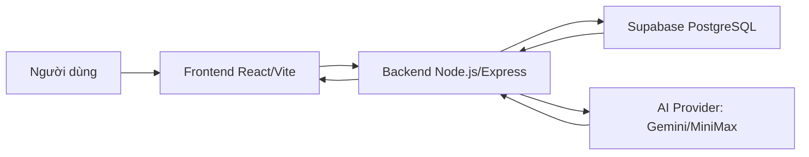

# RoommieMatch
## Website tìm kiếm phòng trọ và hỗ trợ ghép phòng bằng AI

Báo cáo thực tập cuối khóa  
Vị trí: Thực tập sinh phát triển website sử dụng ReactJS  
Đơn vị thực tập: Công ty TNHH Stramark Việt Nam

---

# Bối Cảnh Đề Tài

Nhu cầu tìm phòng trọ hiện nay thường bị phân tán qua nhiều kênh như mạng xã hội, tin nhắn cá nhân hoặc các bài đăng thiếu kiểm chứng.

Người thuê khó so sánh thông tin phòng, chủ trọ mất thời gian quản lý lịch xem phòng, còn quản trị viên cần công cụ kiểm soát chất lượng tin đăng.

RoommieMatch được xây dựng để gom các bước tìm phòng, đăng phòng, đặt lịch, đặt cọc, trò chuyện và hỗ trợ bằng AI vào một nền tảng web thống nhất.

---

# Mục Tiêu Dự Án

Xây dựng website hỗ trợ tìm kiếm phòng trọ với giao diện dễ sử dụng, dữ liệu được quản lý tập trung và có khả năng mở rộng.

- Hỗ trợ nhiều nhóm người dùng: người thuê, chủ trọ, môi giới và quản trị viên
- Cho phép tìm phòng, xem chi tiết, yêu thích, đặt lịch xem phòng và đặt cọc
- Hỗ trợ chủ trọ đăng tin, chỉnh sửa, quản lý trạng thái phòng
- Cung cấp khu vực quản trị để duyệt phòng, quản lý người dùng và xử lý báo cáo
- Tích hợp AI để gợi ý phòng, phân tích tin đăng và hỗ trợ người dùng

---

# Đối Tượng Người Dùng

RoommieMatch được thiết kế theo mô hình nhiều vai trò, mỗi vai trò có quyền truy cập và luồng thao tác riêng.

| Vai trò | Nhu cầu chính |
|---|---|
| Người thuê | Tìm phòng, lưu yêu thích, đặt lịch, đặt cọc, trò chuyện |
| Chủ trọ | Đăng phòng, quản lý phòng, xử lý yêu cầu và lịch hẹn |
| Môi giới | Theo dõi khách hàng tiềm năng, phòng phụ trách và hoa hồng |
| Quản trị viên | Duyệt tin, quản lý người dùng, báo cáo và toàn bộ hệ thống |

---

# Công Nghệ Sử Dụng

Hệ thống được phát triển theo mô hình web hiện đại gồm frontend, backend và cơ sở dữ liệu đám mây.

- Frontend: ReactJS, Vite, React Router, Axios, Supabase JS
- Backend: Node.js, Express, JWT, Multer, Supabase JS
- Database: Supabase PostgreSQL
- AI: Google Gemini và MiniMax AI
- Kiểm thử và chất lượng mã nguồn: Node Test Runner, ESLint, build frontend

---

# Kiến Trúc Tổng Quan

RoommieMatch tách rõ phần giao diện, API xử lý nghiệp vụ và cơ sở dữ liệu.

Cách tổ chức này giúp giao diện dễ phát triển, backend dễ mở rộng và dữ liệu được quản lý tập trung.

---

# Chức Năng Cho Người Thuê

Người thuê là nhóm người dùng trung tâm của hệ thống, tập trung vào quá trình tìm và ra quyết định thuê phòng.

- Xem danh sách phòng đã được duyệt
- Lọc và xem chi tiết phòng
- Lưu phòng yêu thích
- Đặt lịch xem phòng
- Gửi yêu cầu ghép phòng hoặc liên hệ với chủ trọ
- Đặt cọc và theo dõi trạng thái đặt cọc
- Trò chuyện trực tiếp trong hệ thống

---

# Chức Năng Cho Chủ Trọ Và Môi Giới

Chủ trọ và môi giới có các công cụ để quản lý nguồn phòng, khách hàng và quá trình giao dịch.

- Đăng tin phòng mới kèm thông tin, tiện ích, quy định và hình ảnh
- Chỉnh sửa thông tin phòng và quản lý ảnh
- Bật/tắt trạng thái còn phòng hoặc ẩn phòng
- Theo dõi lịch hẹn và yêu cầu từ người thuê
- Quản lý khách hàng tiềm năng
- Theo dõi hoa hồng đối với vai trò môi giới

---

# Chức Năng Quản Trị

Khu vực quản trị giúp kiểm soát chất lượng nội dung và vận hành toàn bộ nền tảng.

- Duyệt hoặc từ chối phòng chờ kiểm duyệt
- Quản lý toàn bộ danh sách phòng
- Quản lý người dùng theo vai trò
- Xử lý báo cáo từ người dùng
- Theo dõi dữ liệu vận hành qua dashboard

Nhờ cơ chế phân quyền, người dùng chỉ truy cập được các chức năng phù hợp với vai trò của mình.

---

# Tích Hợp AI

AI được tích hợp để nâng cao trải nghiệm tìm phòng và hỗ trợ quá trình đăng tin.

- Gợi ý phòng phù hợp theo nhu cầu, ngân sách và vị trí mong muốn
- Trả lời câu hỏi của người dùng trong trợ lý AI
- Sinh mô tả phòng từ thông tin cơ bản
- Phân tích chất lượng tin đăng và đề xuất cải thiện
- Tóm tắt đánh giá, ưu điểm, nhược điểm và rủi ro của phòng

Điểm nổi bật là AI không chỉ trả lời chung chung mà còn kết hợp dữ liệu phòng và ngữ cảnh người dùng để đưa ra gợi ý thực tế hơn.

---

# Kết Quả Đạt Được

Sau quá trình thực hiện, dự án đã hoàn thiện cấu trúc chính của một website tìm phòng trọ đa vai trò.

- Xây dựng frontend React với các trang chức năng theo từng vai trò
- Kết nối frontend với backend thông qua service và API client
- Triển khai luồng đăng ký, đăng nhập, phân quyền và bảo vệ route
- Hoàn thiện các chức năng cốt lõi: tìm phòng, đăng phòng, yêu thích, lịch hẹn, đặt cọc, trò chuyện, quản trị
- Tích hợp các chức năng AI hỗ trợ người thuê và chủ trọ
- Có lệnh kiểm tra tổng gồm encoding, backend test, lint và build frontend

---

# Bài Học Kinh Nghiệm

Dự án giúp vận dụng kiến thức lập trình web vào một sản phẩm có luồng nghiệp vụ thực tế.

- Hiểu rõ hơn cách tổ chức source code React theo component, page, service và context
- Rèn luyện cách thiết kế route và phân quyền theo vai trò người dùng
- Nắm được cách frontend giao tiếp với backend qua REST API
- Có kinh nghiệm xử lý dữ liệu động, trạng thái đăng nhập và các tình huống phát sinh
- Học cách tích hợp dịch vụ AI vào website để tạo giá trị sử dụng rõ ràng

---

# Kết Luận

RoommieMatch là sản phẩm web hỗ trợ giải quyết bài toán tìm phòng trọ bằng cách kết nối người thuê, chủ trọ, môi giới và quản trị viên trên cùng một hệ thống.

Dự án giúp củng cố kỹ năng ReactJS, Node.js/Express, Supabase, phân quyền người dùng và tích hợp AI. Đây là nền tảng quan trọng để tiếp tục hoàn thiện kỹ năng phát triển website trong môi trường thực tế.

Hướng phát triển tiếp theo có thể gồm tối ưu giao diện người dùng, bổ sung thanh toán trực tuyến, cải thiện thuật toán gợi ý phòng và mở rộng hệ thống đánh giá độ tin cậy của tin đăng.
